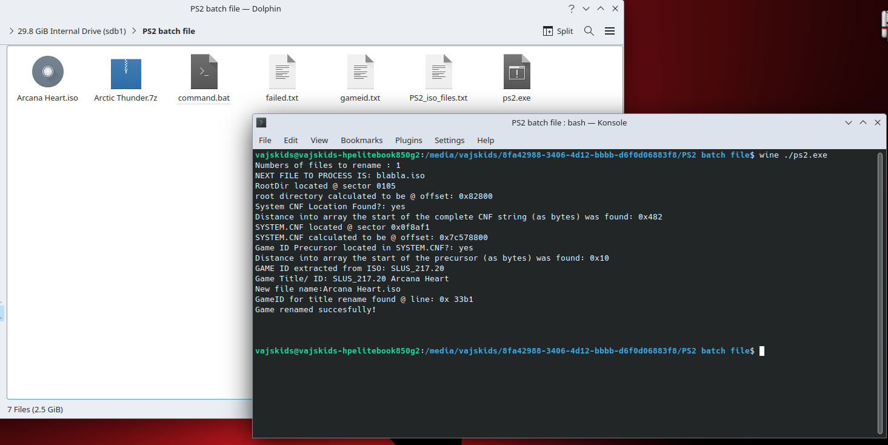
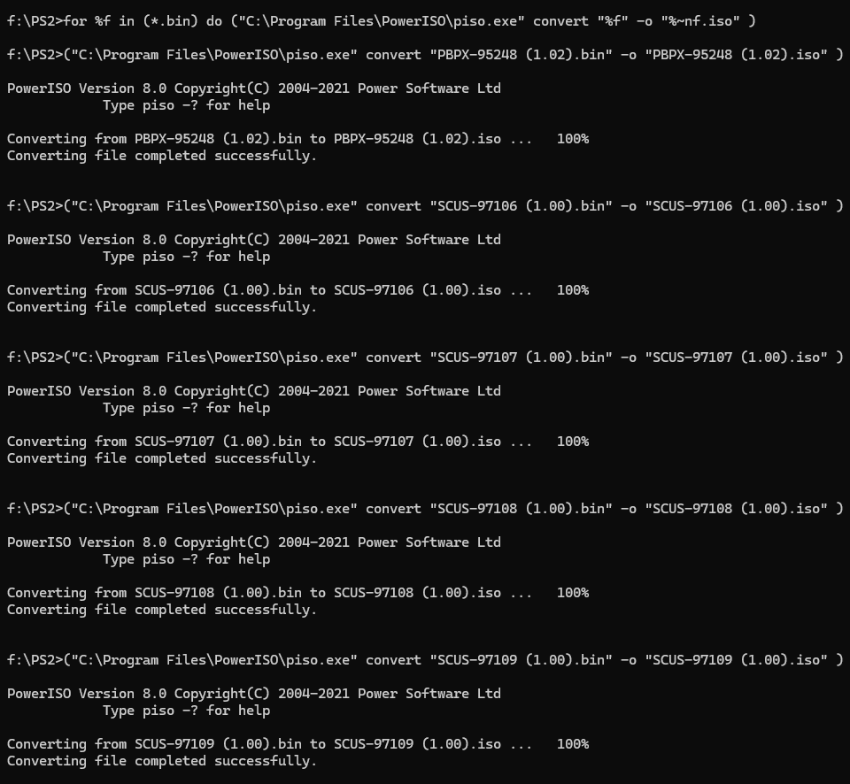

# PS2-ISO-Batch-Renamer- (c) VajskiDs Consoles 2022

Just unzip the gameid.txt and ps2.exe file into your ps2 ISO folder.<br />
Grab the gameid.txt from the root of this repository as it will be more up to date!<br />
No matter what the game is called (as long as it has extension *.iso) - it will be renamed appropriately.<br />
!!PS2 ISO's ONLY!!

Requires dotnet: https://dotnet.microsoft.com/en-us/download<br />
Demo: https://www.youtube.com/watch?v=4r0DLwKOaX0<br />

A few minor changes were made post demo video after testing with a much greater amount of games.
The initial versions were searching for 3 HEX values for "CNF". 
It appears some games have more than one ".CNF" file - the search was enlarged to "EM.CNF" and adjustments were made to work backwards from here to the SYSTEM.CNF location bytes.

I also realised Onimusha Dawn of dreams has 2 GAMEID's, just the GAMEID's used on the lookup table are doubled up on names. 


<br />
I have uploaded the original excel file from "Ranzer11" @ https://forums.pcsx2.net/Thread-PS2-Renamer-Tool-v1
<br />
This seems to be a far more thorough list, but isn't formattted correctly!
<br />

gameid.txt comes from HDLBatch! I will keep an updated version here and append changes made. <br />
Please note, when adding your own -Add them with a null at the end of the line and no blank new line.<br />
<br />
So far:
<br />
Onimusha - Dawn of dreams has being separated to 2 discs (they were sharing the same title)<br />
<br />
Added Disc Numbers: <br />
<br />
SLES_820.38 Onimusha - Dawn of Dreams [Disc 1] <br />
SLES_820.39 Onimusha - Dawn of Dreams [Disc 2] <br />
<br />
Added Disc Number and re-grouped: <br />
<br />
SLUS_211.80 Onimusha - Dawn of Dreams [Disc 1] <br />
SLUS_213.62 Onimusha - Dawn of Dreams [Disc 2] <br />

Corrected Typos <br />

SCES_533.99 Yazuka Fury <br />
SCES_541.71 Yazuka <br />
SLES_533.99 Yazuka Fury <br />
SLES_541.71 Yazuka <br />
SLUS_217.69 Yazuka 2 <br />
<br />
All to 'Yakuza' 
<br />
<br />
<br />
<br />
Added
<br />
SLUS_218.67 Guitar Hero - Van Halen <br />
SLUS_219.28 Scooby Doo - and the Spooky Swamp <br />
SLUS_219.00 Scooby-Doo! First Frights <br />
SLUS_218.99 Silent Hill- Shattered Memories <br />
SCUS_975.84 Syphon Filter: Logan's Shadow <br />
SLUS_219.04 Teenage Mutant Ninja Turtles: Smash-Up <br />
SLUS_219.15 The Lord of the Rings - Aragorn's Quest <br />
SLUS_218.83 Disney-Pixar's Cars - Race-O-Rama <br />
SLUS_219.23 Dora the Explorer- Dora Saves the Crystal Kingdom <br />
SLUS_219.44 Dora the Explorer- Dora's Big Birthday Adventure <br />
SLUS_219.26 Ni Hao - Kai-Lan- Super Game Day <br />
SLUS_219.55 PRO EVOLUTION SOCCER 2013 <br />
SCUS_943.46 SingStar Latino <br />
SCUS_976.27 Singstar Pop Volume 2 <br />
SLES_546.68 Thomas  Friends - A Day at the Races<br />
SLUS_219.40 WWE ALL STARS <br />
SLUS_219.01 WWE Smackdown! vs. RAW 2010 <br /> 
SLUS_219.39 WWE Smackdown! vs. RAW 2011 <br />
SLUS_210.33 Second Sight <br />
SLPS-20318 3D Kakutou Tsukuru 2 [Enterbrain Collection] <br />
SLES-54973 Avventure di Lupin III, Le - Lupin la Morte, Zenigata l'Amore <br />
SLES-82019 Cy Girls (Aska Disc) <br />
SLES-82021 Cy Girls (Aska Disc) <br />
SLES-82018 Cy Girls (Ice Disc) <br />
SLES-82020 Cy Girls (Ice Disc) <br />
SCES-54623 Grand Theft Auto - Vice City Stories <br />
SLES-54623 Grand Theft Auto - Vice City Stories <br />
SLPM-66917 Grand Theft Auto - Vice City Stories <br />
SLUS-21590 Grand Theft Auto - Vice City Stories <br />
SLES-50903 MegaRace 3 - Nanotech Disaster <br />
SLUS-20932 Mercenaries - Playground of Destruction <br />
SLES-52588 Mercenaries - Playground of Destruction <br />
SLES-52590 Mercenaries - Playground of Destruction <br />
SLES-53008 Mercenaries - Playground of Destruction <br />
SLES-52589 Mercenaries - Playground of Destruction <br />
SLED-52979 Mercenaries - Playground of Destruction (Demo) <br />
SLES-54998 Mercenaries 2 - World in Flames <br />
SLES-54999 Mercenaries 2 - World in Flames <br />
SLES-54997 Mercenaries 2 - World in Flames <br />
SLES-55000 Mercenaries 2 - World in Flames <br />
SLES-55001 Mercenaries 2 - World in Flames <br />
SCES-55019 Ratchet & Clank - Size Matters <br />
SLES-54644 Valkyrie Profile 2 - Silmeria <br />
SLES-54645 Valkyrie Profile 2 - Silmeria <br />
SLES-54647 Valkyrie Profile 2 - Silmeria <br />
SLES-54646 Valkyrie Profile 2 - Silmeria <br />
SLES-54648 Valkyrie Profile 2 - Silmeria <br />
SLPS-25196 Venus & Braves - Majo to Megami to Horobi no Yogen <br />
SLPS-25195 Venus & Braves - Majo to Megami to Horobi no Yogen (Premium Box) <br />
SLPS-73236 Venus & Braves - Majo to Megami to Horobi no Yogen <br />
SCAJ-20012 Venus & Braves - Majo to Megami to Horobi no Yogen <br />
<br />
<br />
09/09/24 <br />
SCUS_976.57 MLB 11: The Show <br />
SLUS_208.07 Space Channel 5: Special Edition <br />
SLUS_209.14 Ribbit King Plus! (Bonus Disc) <br />
SLUS_215.63 Ribbit King Plus! (Bonus Disc) <br />
SLUS_217.04 Final Fantasy XI: Vana'diel Collection 2008 <br />
SLUS_217.05 Madden NFL 08 <br />
SLUS_217.13 Winter Sports 2008: The Ultimate Challenge <br />
SLUS_217.38 Nitrobike <br />
SLUS_217.64 Cake Mania: Baker's Challenge <br />
SLUS_217.86 Summer Athletics: The Ultimate Challenge <br />
SLUS_217.98 Shepherd's Crossing <br />
SLUS_218.41 Cabela's Dangerous Hunts 2009 <br />
SLUS_218.98 Band Hero <br />
SLUS_219.05 FIFA 10 <br />
SLUS_219.06 Cabela's Outdoor Adventures (2009) <br />
SLUS_219.07 Jurassic: The Hunted <br />
SLUS_219.09 DJ Hero <br />
SLUS_219.18 Pro Evolution Soccer 2010 <br />
SLUS_219.19 Backyard Football '10 <br />
SLUS_219.27 Sakura Wars: So Long, My Love (Disc 1) <br />
SLUS_219.30 Sakura Wars: So Long, My Love (Disc 2) <br />
SLUS_219.29 Major League Baseball 2K10 <br />
SLUS_219.31 Disney Pixar Toy Story 3 <br />
SLUS_219.32 NCAA Football 11 <br />
SLUS_219.33 Despicable Me: The Game <br />
SLUS_219.34 Rapala Pro Bass Fishing <br />
SLUS_219.35 Cabela's North American Adventures <br />
SLUS_219.36 NBA 2K11 <br />
SLUS_219.37 Madden NFL 11 <br />
SLUS_219.38 Ben 10 Ultimate Alien: Cosmic Destruction <br />
SLUS_219.41 FIFA 11 <br />
SLUS_219.42 Pro Evolution Soccer 2011 <br />
SLUS_219.45 Major League Baseball 2K11 <br />
SLUS_219.46 Madden NFL 12 <br />
SLUS_219.47 FIFA 12 <br />
SLUS_219.48 Pro Evolution Soccer 2012 <br />
SLUS_219.50 NBA 2K12 <br />
SLUS_219.51 Major League Baseball 2K12 <br />
SLUS_202.91 Big Mutha Truckers <br />
SLUS_216.96 Ford Racing: Off Road <br />
SLUS_217.49 Garfield: Lasagna World Tour <br />
SLUS_217.60 Jeep Thrills <br />
<br />
Corrected the formatting of the last database entries prior to 09/09/24 (SLPS-20318 to SCAJ-20012)
<br /> 
<br />
Renamed the following from the original GameID existing before this app existed<br />
These won't get added to the failed renames as the application thinks it has renamed it successfully. You can not have slashes in a file name.  <br />
<br /> 
<br />
.hack Series <br />
SCES_522.37 - .hack - Infection Part 1 <br />
SLES_522.37 - .hack - Infection Part 1 <br />
SLKA_250.80 - .hack - Infection Part 1 <br />
SLUS_202.67 - .hack - Infection Part 1 <br />
SLUS_280.23 - .hack - Infection Part 1 [Trade Demo] <br />
SLUS_290.42 - .hack - Infection Part 1 [Demo] <br />
<br />
.hack - Mutation <br />
SCES_524.67 - .hack - Mutation Part 2 <br />
SLES_524.67 - .hack - Mutation Part 2 <br />
SLKA_251.38 - .hack - Mutation Part 2 <br />
SLUS_205.62 - .hack - Mutation Part 2 <br />
SLUS_280.32 - .hack - Mutation Part 2 [Trade Demo] <br />
SLUS_290.55 - .hack - Mutation Part 2 [Demo] <br />
<br />
.hack - Outbreak <br />
SCES_524.69 - .hack - Outbreak Part 3 <br />
SLES_524.69 - .hack - Outbreak Part 3 <br />
SLKA_251.45 - .hack - Outbreak Part 3 <br />
SLUS_205.63 - .hack - Outbreak Part 3 <br />
SLUS_290.65 - .hack - Outbreak Part 3 [Demo] <br />
<br />
.hack - Quarantine <br />
SCES_524.68 - .hack - Quarantine Part 4 <br />
SLES_524.68 - .hack - Quarantine Part 4 <br />
SLKA_251.74 - .hack - Quarantine Part 4 <br />
SLUS_205.64 - .hack - Quarantine Part 4 <br />
SLUS_290.84 - .hack - Quarantine Part 4 [Demo] <br />
<br />
.hack//Vol.1 <br />
SCPS_550.29 - .hack Vol.1 <br />
SLPS_251.21 - .hack Vol.1 <br />
SLPS_732.30 - .hack Vol.1 & Vol.2 [PlayStation 2 The Best] [Vol.1 Disc] <br />
<br />
.hack//Vol.2 <br />
SCPS_550.42 - .hack Vol.2 <br />
SLPS_251.43 - .hack Vol.2 - Mutation <br />
SLPS_732.31 - .hack Vol.1 & Vol.2 [PlayStation 2 The Best] [Vol.2 Disc] <br />
<br />
.hack//Vol.3 <br />
SLPS_251.58 - .hack Vol.3 - Erosion Pollution <br />
SLPS_732.32 - .hack Vol.3 & Vol.4 [PlayStation 2 The Best] [Vol.3 Disc] <br />
<br />
.hack//Vol.4 <br />
SLPS_252.02 - .hack Vol.4 - Zettai Houi <br />
SLPS_732.33 - .hack Vol.3 & Vol.4 [PlayStation 2 The Best] [Vol.4 Disc] <br />
<br />
.hack//Fragment <br />
SLPS_255.27 - .hack Fragment <br />
<br />
.hack//G.U. Vol.1 <br />
SLPS_256.51 - .hack G.U. Vol.1 - Saitan <br />
SLPS_257.55 - .hack G.U. Vol.1 - Saitan [Welcome Price^!^!] <br />
SLPS_257.56 - .hack G.U. Vol.1 - Saitan [Bandai the Best] <br />
SLPS_732.59 - .hack G.U. Vol.1 - Saitan [PlayStation 2 the Best] <br />
SLUS_212.58 - .hack G.U. Vol.1 - Rebirth <br />
SLUS_291.99 - .hack G.U. Vol.1 - Rebirth <br />
<br />
.hack//G.U. Vol.2 <br />
SLPS_256.55 - .hack G.U. Vol.2 - Kimi Omou Koe <br />
SLPS_732.66 - .hack G.U. Vol.2 - Kimi Omou Koe [PlayStation 2 the Best] <br />
SLUS_214.88 - .hack G.U. Vol.2 - Reminisce <br />
<br />
.hack//G.U. Vol.3 <br />
SLPS_256.56 - .hack G.U. Vol.3 - Aruku Youna Hayasa de <br />
SLPS_732.67 - .hack G.U. Vol.3 - Aruku Youna Hayasa de [PlayStation 2 the Best] <br />
SLUS_214.89 - .hack G.U. Vol.3 - Redemption <br />
<br />
.hack - Demo Versions <br />
SLUS_290.42 - .hack - Infection Part 1 [Demo] <br />
SLUS_290.55 - .hack - Mutation Part 2 [Demo] <br />
SLUS_290.65 - .hack - Outbreak Part 3 [Demo] <br />
SLUS_290.84 - .hack - Quarantine Part 4 [Demo] <br />
<br />
<br />
Renamed the following with proper file naming conventions
<br />
<br />
CPCS_010.41 Fate/Unlimited Codes [SP Box] <br />
HAKU_008.01 Hakuouki / Hakuouki - Zuisouroku <br />
SLPM_742.70 Fate/Stay Night [Realta Nua] [PlayStation 2 the Best]<br />
PSXC_002.01 DESR-7000/DESR-5000 Sen'you - PSX Update Disc Ver. 1.10 <br />
PSXC_002.02 DESR-7000/DESR-5000 Sen'you - PSX Update Disc Ver. 1.20 <br />
PSXC_002.03 DESR-7000/DESR-5000/DESR-7100/DESR-5100 Sen'you - PSX Update Disc Ver. 1.31 <br />
PSXC_002.04 DESR-7000/DESR-5000/DESR-7100/DESR-5100 Sen'you - PSX Update Disc Ver. 2.11 <br />
PTPX_970.38 zzz_unknown_03 <br />
SLPM_552.38 Fate/Unlimited Codes [Best Price] <br />
SLPM_551.08 Fate/Unlimited Codes <br />
SLES_554.57 AC/DC LIVE - Rock Band Track Pack <br />
SLES_547.33 Disney/Pixar Ratatouille <br />
SCED_542.08 Magazine Ufficiale PlayStation 2 Italia 06/2006 <br />
SCED_541.80 Magazine Ufficiale PlayStation 2 Demo Italia 05/2006 <br />
SCED_541.49 Magazine Ufficiale PlayStation 2 Italia 04/2006 <br />
SLPS_254.90 Kidou Senshi Gundam Giren no Yabou - Zeon Dokuritsu Sensouden / Kouryaku Shireisho [Gundam the Best] <br />
SCED_510.16 Official PlayStation 2 Magazine Demo 22/23 <br />
SCED_511.11 Magazine Ufficiale PlayStation 2 Demo Italia 08/02 <br />
SCED_511.73 Magazine Ufficiale PlayStation 2 Demo Italia 09/02 <br />
SCED_532.94 Magazine Ufficiale PlayStation 2 Italia 10/2005 - Italian Demo <br />
SCED_535.16 Magazine Ufficiale PlayStation 2 Italian Demo 61 07/05 <br />
SCED_536.62 Official PlayStation 2 Germany Special 2/2005 <br />
SCED_539.33 Magazine Ufficiale PlayStation 2 Demo Italia 01/2006 <br />
SCED_539.38 Official PlayStation 2 Germany Special 3/2005 <br />
SCED_540.90 Magazine Ufficiale PlayStation 2 Demo Italia 03/2006 <br />
SCED_532.17 Official PlayStation 2 Magazine Germany 2006/02 <br />
SCED_532.14 Official PlayStation 2 Magazine Germany 2005/12 <br />
SCED_532.15 Official PlayStation 2 Magazine Germany 2005/13 <br />
SCED_532.09 Official PlayStation 2 Magazine Germany 2005/07 <br />
SCED_532.10 Official PlayStation 2 Magazine Germany 2005/08 <br />
SCED_532.11 Official PlayStation 2 Magazine Germany 2005/09 <br />
SCED_531.76 Magazine Ufficiale PlayStation 2 Demo 03/2005 <br />
SCED_530.70 Magazine Ufficiale PlayStation 2 Demo 2005/01 ITA <br />
SCED_529.97 Official PlayStation 2 Magazine Sonderausgabe 2004/3 <br />
SCED_529.81 Magazine Ufficiale PlayStation 2 Italia 11/04 <br />
SCED_528.55 Magazine Ufficiale PlayStation 2 Italia 09/04 <br />
SCED_526.19 Magazine Ufficiale PlayStation 2 Italia 08/04 <br />
SCED_525.80 Magazine Ufficiale PlayStation 2 Italia 06/04 <br />
SCED_524.43 Magazine Ufficiale PlayStation 2 Italia 05/04 <br />
SCED_523.54 Magazine Ufficiale PlayStation 2 Italia Demo 03/04 <br />
SCED_522.72 Magazine Ufficiale PlayStation 2 Italia Demo 02/04 <br />
SCED_521.86 Magazine Ufficiale PlayStation 2 Italia 01/04 Demo <br />
SCED_521.19 Official PlayStation 2 Magazine Germany Special Edition 01/2004 <br />
SCED_520.90 Official PlayStation 2 Magazine Germany 10/04 <br />
SCED_520.81 Official PlayStation 2 Magazine Uncut Edition 01/04 <br />
SCED_520.76 Official PlayStation 2 Magazine Germany 09/04 <br />
SCED_520.57 Magazine Ufficiale PlayStation 2 Italia 12/03 <br />
SCED_519.35 Official PlayStation 2 Magazine Demo 38 Uncut 11/03 <br />
SCED_518.94 Magazine Ufficiale PlayStation 2 Demo Italia 09/03 <br />
SCED_517.52 Magazine Ufficiale PlayStation 2 Demo Italia 06/03 <br />
SCED_518.36 Magazine Ufficiale PlayStation 2 Demo Italia 07/03 <br />
SCED_518.80 Magazine Ufficiale PlayStation 2 Demo Italia 08/03 <br />
SCED_516.52 Magazine Ufficiale PlayStation 2 Demo Italia 04/03 <br />
SCED_515.51 Official PlayStation 2 Magazine Germany Special Edition 2003/03 <br />
SCED_515.49 Official PlayStation 2 Magazine Germany Special Edition 2003/02 <br />
SCED_515.12 Official PlayStation 2 Magazine Special Edition 2003/01 <br />
SCED_514.11 Magazine Ufficiale PlayStation 2 Italia 02/03 <br />

<br />
<br />
<p align="center">
  
</p>
<br />
<br />
<br />
<br />
Yes, it works in linux.
<br />
<br />
<br />
<br />

<p align="center">
  
</p>


My Last mass PS2 download after being forced to wipe my PC clear was just under 5TB for the US library, I found 292 files were BIN files as opposed to ISO files so had a quick poke around to find a way to batch convert.
<br />
<br />
<br />
You can use this: 
<br />
<br />
https://archive.org/details/power-iso.-7z
<br />
<br />
I don't condone in the use of cracked software, if you like powerISO, please pay for it.
<br />
<br />
This is the batch script and assumes the default installation location for powerISO, otherwise, change it to suit the location of the piso.exe
<br />
<br />

```
for %%f in (*.bin) do ("C:\Program Files\PowerISO\piso.exe" convert "%%f" -o "%%~nf.iso")
```

<br />
Run that from within your PS2 ISO folder. <br />
After this, you can re-run the PS2-ISO-Batch-Renamer to finalise the renaming. <br />
it should be noted my source of these images came with SLUS-20079 (Dynasty Warriors 2, 2 BIN tracks ), and SLUS-21296 (Dance Factory, 6 BIN tracks) however they didn't come with a cue file. I simply deleted them. Source them elsewhere if you want to use them.
