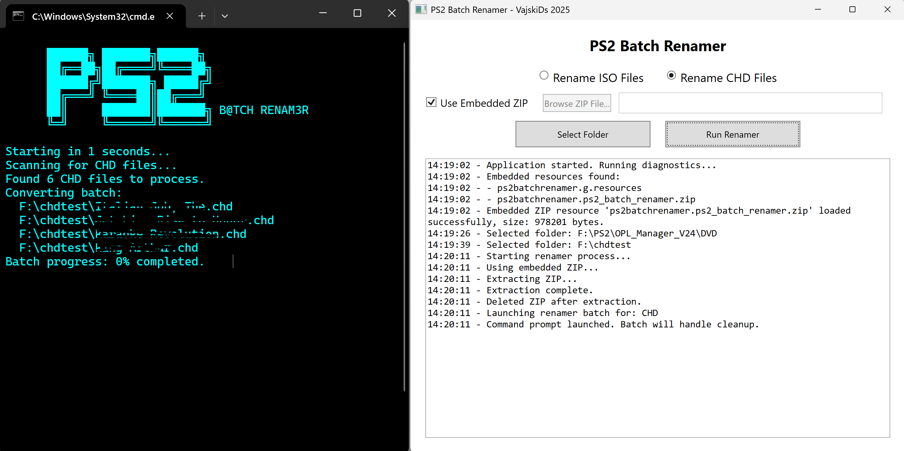

# PS2 Batch Renamer

**PS2 Batch Renamer** is a Windows desktop tool designed to help you batch rename PlayStation 2 ISO and CHD files based on their internal game IDs. It extracts and uses a lookup table to rename your game files automatically, simplifying your PS2 game library management.

---

## Features

- Rename ISO files or CHD files (Choose mode via radio buttons)  
- Use an embedded ZIP package of renaming tools or select an external ZIP file manually  
- Select your working folder for batch renaming easily  
- Displays detailed status and diagnostic logs during operation  
- Launches a command prompt window to run the batch renaming process  
- Automatic cleanup of temporary files after renaming  

---

## ZIP File Contents and Purpose

The ZIP file contains all the necessary tools and files needed to perform the renaming tasks. It can be updated independently from the GUI app, allowing database or tool updates without rebuilding the frontend GUI.

**Current ZIP file structure:**

PS2_batch_renamer.zip  
├── ps2.exe (Renamer executable for ISO files)  
├── chd_ps2_renamer.exe (Renamer executable for CHD files)  
├── run_renamer.bat (Batch script that runs the renamer tools and cleans up after)  
├── gameid.txt (Lookup table for game IDs to names)  
├── chdman.exe (Tool for CHD extraction, handled by chd_ps2_renamer.exe)  
└── ps2_chd.exe (Modified ps2.exe for CHD files, handled by chd_ps2_renamer.exe)  

**Important:**  
At this point in time (release/upload), for the database and all required files, you should **only use the embedded ZIP** to ensure compatibility and prevent errors.  
The option to select an external ZIP manually exists mainly so the frontend GUI **does not have to be rebuilt** if there are database or tool updates in the future. You may also have some failed isos in your collection that you wish to add to the database yourself, hence you can repack it into the zip file and select it manually. The zip file can be of any name, as long as it contains the necessary files from the file tree above.

---

## How to Use

1. Choose whether to use the embedded renaming tools ZIP file or browse to select an external ZIP file.  
2. Select the folder containing your PS2 ISO or CHD files.  
3. Choose the file type mode (ISO or CHD).  
4. Click **Run Renamer** to start the batch process.  
5. Follow the command prompt window to see the progress.

---

## Known Bug

- In **CHD mode**, the tool recreates the logs of renamed and failed files between each batch of 4 files (or fewer if less remain).  
- This means logs are **overwritten** each time a new batch starts, losing previous batch info.  
- This is a known issue and I CBF fixing it :D

---

## Requirements

- Windows 10 or later  
- .NET 8.0 Runtime

Well actually, this here's a large self contained exe containing .NET 8, so you don't actually need it ...but even
compressed into a 7z archive, it's a little too large for githubs 25MB limit.

You can grab the app here: https://drive.google.com/file/d/1pIVizPx3WEuAiFIecB9LVMd68k8i8u-h/view?usp=sharing

Otherwise, there will be a tiny version on the releases page; same app - but it will require .NET 8.00.

---

## License

MIT License

Copyright (c) 2025 VajskiDs

Permission is hereby granted, free of charge, to any person obtaining a copy
of this software and associated documentation files (the "Software"), to deal
in the Software without restriction, including without limitation the rights
to use, copy, modify, merge, publish, distribute, sublicense, and/or sell
copies of the Software, and to permit persons to whom the Software is
furnished to do so, subject to the following conditions:

The above copyright notice and this permission notice shall be included in
all copies or substantial portions of the Software.

THE SOFTWARE IS PROVIDED "AS IS", WITHOUT WARRANTY OF ANY KIND...

---

## Contact

Created by VajskiDs - 2025  
For questions or issues, please open an issue on the GitHub repo or contact me directly.
